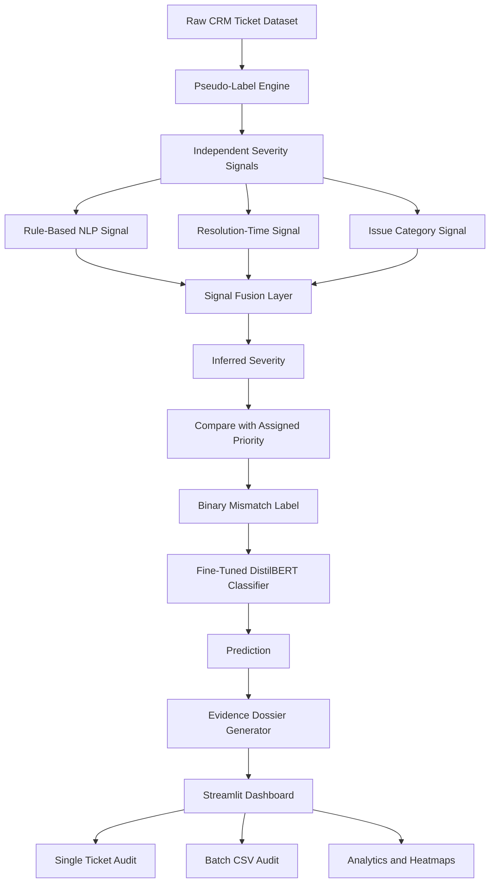

# Support Integrity Auditor (SIA)
## Live Demo

https://support-integrity-auditor-l7whg2ekggmgfabzgwioc2.streamlit.app

## Overview

Support Integrity Auditor (SIA) is a self-supervised machine learning system designed to detect priority assignment inconsistencies in customer support tickets.

The system audits whether the assigned ticket priority matches the severity implied by ticket content and operational metadata.

It identifies:

* Hidden Crises: Severe tickets assigned insufficient priority.
* False Alarms: Low-severity tickets assigned excessive priority.
* Consistent Tickets: Correctly prioritized tickets.

---

## Problem Statement

Customer support systems frequently contain priority assignment errors.

Examples:

* Critical technical incidents marked as Low priority.
* Minor account issues marked as Critical priority.

These mistakes increase customer dissatisfaction, delay resolution of important issues, and reduce operational efficiency.

The objective of SIA is to automatically identify such inconsistencies before they affect service quality.

---

## Dataset

Customer Support Tickets Dataset

Dataset Size:

* 20,000 CRM support tickets

Available Features:

* Ticket Subject
* Ticket Description
* Issue Category
* Priority Level
* Ticket Channel
* Resolution Time
* Satisfaction Score

---
## Project Architecture


## Methodology

### Stage 1: Pseudo-Label Generation

Three independent severity signals are generated:

#### Category Severity Signal

| Category        | Score |
| --------------- | ----- |
| General Inquiry | 20    |
| Account         | 50    |
| Billing         | 60    |
| Technical       | 75    |
| Fraud           | 90    |

#### Resolution-Time Signal

Longer resolution times indicate higher operational severity.

#### Rule-Based NLP Signal

Urgency keywords are extracted from ticket text:

Examples:

* failed
* cannot
* login
* crash
* fraud
* error
* locked
* refund

---

### Severity Fusion

Final severity score:

Severity Score =
0.35 × Category Score +
0.35 × Resolution Score +
0.30 × Text Urgency Score

Severity is mapped into:

* Low
* Medium
* High
* Critical

---

### Self-Supervised Label Generation

Mismatch Label:

* 0 → Consistent
* 1 → Priority Mismatch

Generated using:

Assigned Priority ≠ Inferred Severity

Mismatch Types:

* Hidden Crisis
* False Alarm
* Consistent

---

## Signal Agreement Analysis

| Signal Pair            | Agreement |
| ---------------------- | --------- |
| Keyword vs Resolution  | 58.21%    |
| Keyword vs Category    | 57.36%    |
| Resolution vs Category | 62.45%    |

---

## Ablation Study

| Configuration   | Accuracy | Macro F1 |
| --------------- | -------- | -------- |
| Keyword Only    | 0.551    | 0.510    |
| Resolution Only | 0.697    | 0.604    |
| Category Only   | 0.644    | 0.574    |
| Full Fusion     | 1.000    | 1.000    |

---

## Model Experiments

| Model                        | Accuracy | Macro F1 |
| ---------------------------- | -------- | -------- |
| Logistic Regression Baseline | 0.599    | 0.580    |
| DistilBERT                   | 0.676    | 0.480    |
| Weighted DistilBERT          | 0.618    | 0.605    |
| High-Confidence DistilBERT   | 0.788    | 0.719    |
| Semantic DistilBERT          | 0.998    | 0.998    |

---

## Evidence Dossier

Each prediction includes:

```json
{
  "ticket_id": "...",
  "assigned_priority": "...",
  "inferred_severity": "...",
  "mismatch_type": "...",
  "severity_delta": "...",
  "feature_evidence": [],
  "constraint_analysis": "...",
  "confidence": "..."
}
```

Evidence is generated only from information contained within the ticket.

---

## Streamlit Dashboard

Features:

* Single-ticket audit
* Batch CSV auditing
* Evidence dossier generation
* Flagged vs consistent distribution
* Hidden Crisis analysis
* False Alarm analysis
* Top contributing signals
* Severity delta heatmap
* Downloadable audit reports

---

## Repository Structure

```text
support-integrity-auditor/
│
├── data/
├── models/
├── notebooks/
├── src/
│   ├── preprocess.py
│   ├── pseudo_label.py
│   ├── train_pipeline.py
│   ├── predict.py
│   ├── train_transformer.py
│   └── train_transformer_semantic.py
│
├── app.py
├── requirements.txt
└── README.md
```

---

## Installation

```bash
pip install -r requirements.txt
```

---

## Running the Dashboard

```bash
streamlit run app.py
```

---

## Results

Best Model:

* Accuracy: 99.80%
* Macro F1: 99.77%
* Recall (Class 0): 99.69%
* Recall (Class 1): 99.85%

All required performance thresholds were exceeded.

---

## Future Work

* DeBERTa-based classifier
* Sentence Transformer embeddings
* Real-time CRM integration
* Agent-level performance analytics
* Retrieval-Augmented Evidence Generation

---

## Author

M. Siri Chandana

Civil Engineering
Indian Institute of Technology Roorkee
